<h3><code>rehbar@github ~ $ ./contributions.sh</code></h3>

  

<h3><code>rehbar@github ~ $ whoami</code></h3>

  

<h3><code>rehbar@github ~ $ neofetch</code></h3>

  

 

<h3><code>rehbar@github ~ $ cat about.md</code></h3>

Full-Stack & Gen-AI developer from Mumbai, India, with hands-on production experience building multi-agent systems, RAG pipelines, and end-to-end applications. Currently an **AI Engineer Intern at DotSyndicate**, building AI infrastructure used globally. National-level hackathon winner (**12+ hackathons, multiple 1st-place finishes**) with a track record of shipping products under pressure.

 

<h3><code>rehbar@github ~ $ cat tech-stack.txt</code></h3>

**Languages**

**Generative AI & Agents**

**Frontend & Mobile**

**Backend**

**DevOps & Cloud**

 

<h3><code>rehbar@github ~ $ cat experience.log</code></h3>

**AI Engineer Intern** — DotSyndicate &nbsp;·&nbsp; *Feb 2026 – Present*
- Building production-grade chatbots and multi-agent systems with LangChain, LangGraph & LangSmith for tracing, evaluation and observability — powering products used globally.
- Designing RAG pipelines backed by vector databases for accurate, context-aware retrieval; integrating tools over MCP & gRPC for scalable, low-latency agent communication.
- Shipped a core algorithm powering a live application used by a large user base, and optimized chatbot latency, cost and response quality for production.

**Software Developer Intern** — ASUKA &nbsp;·&nbsp; *Jul 2024 – Feb 2026*
- Built a full-featured B2B e-commerce mobile app (React Native / Flutter) with a Django backend managing products, orders and users, plus an admin panel.
- Added real-time in-app notifications, automated email flows, third-party API integrations and handled end-to-end deployment.

**Core Member** — CodeCell, Mumbai University &nbsp;·&nbsp; *Jan 2024 – Present*
- Lead a 20-member student org promoting tech & innovation; organized coding events, workshops and tech talks, and shipped two live event-management websites.

 

<h3><code>rehbar@github ~ $ ls projects/</code></h3>

| Project | Stack | Links |
|---|---|---|
| **Ape.Ai** — AI-powered learning & career hub with roadmaps, AI-proctored testing and a two-sided AI interview module | Next.js · Django · LangChain · LangFlow · RAG · FastAPI · K8s | *ongoing* |
| **Git AI** — multi-agent workflow tracking org contributions from verified GitHub REST data with zero hallucination; auto-delivers reports to Discord | Python · CrewAI · GitHub API · OpenAI | [Code](https://github.com/arshhimself/gitai) |
| **RAG-Powered Telegram Bot** — answers strictly from uploaded PDFs using embeddings + GPT-4o-mini | Python · LangChain · OpenAI · Vector Search | — |
| **Nexus RCOE** — event, team & registration platform with real-time updates and automated workflows (errors −40%) | Next.js · Django · Supabase · S3 · Cron | [Live](https://nexus-rcoe.vercel.app) |
| **NutriScan** — real-time food/medicine label analysis with barcode scanning, allergen alerts & dietary insights | Next.js · Django · CV · ML · Docker | [Code](https://github.com/arshhimself/NutriScan) |
| **CRODLIN Connect** — CRM mobile app with analytics, user management & automated emails; expanding into ERP | Flutter · Django · Supabase · CI/CD | — |

 

<h3><code>rehbar@github ~ $ cat achievements.txt</code></h3>

- 🏆 **Winner, National-Level Hackathon** — Algorithm 9.0, AIKTC (Feb 2025): led team to 1st place building APE AI.
- 🥇 **Winner, State-Level Hackathon** — Bit n Build, GDSC Maharashtra (Oct 2025): advanced to nationals with Aarogya Sahayak, an offline-first AI healthcare platform for ASHA workers.
- 🎯 **Top 10 Finalist** in 3 additional national hackathons across AI, automation & edtech.
- 🚀 **Lead, Nexus (Open-Source Club), Mumbai University** — founded and lead an open-source platform with a merit-driven selection process, idea-voting and Git-AI automation.

 

<h3><code>rehbar@github ~ $ cat education.txt</code></h3>

- **IIT Madras** — BS in Data Science &nbsp;·&nbsp; *2023 – Present*
- **Mumbai University** — B.E. in Computer Science &nbsp;·&nbsp; *2023 – Present*

 

<code>rehbar@github ~ $ echo "Thanks for visiting — let's build something."</code>

